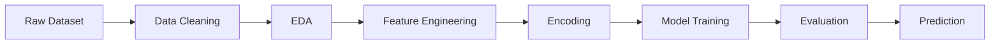

# Titanic-Survival-Prediction

<div align="center">

# 🚢 Titanic Survival Prediction


<br>


</div>

---

## 🎯 Overview

Predicting passenger survival on the Titanic using machine learning and feature engineering techniques.

### Key Highlights

```diff
+ 891 passenger records analyzed
+ Advanced feature engineering
+ Multiple model comparison
+ Cross-validation evaluation
+ ROC-AUC performance analysis
+ Automated visualization pipeline
```

---

## 🧠 Engineered Features

<table>
<tr>
<td width="50%">

### Passenger Features

* 👤 Title Extraction
* 👨‍👩‍👧 Family Size
* 🚶 IsAlone Indicator
* 🎂 Age Categories

</td>
<td width="50%">

### Travel Features

* 🎟️ Fare Bands
* 🚢 Passenger Class
* 🏠 Cabin Deck
* 🌍 Embarkation Port

</td>
</tr>
</table>

---

## 📊 Model Leaderboard

| Rank | Model               | Accuracy | ROC-AUC   |
| ---- | ------------------- | -------- | --------- |
| 🥇   | Logistic Regression | 81.56%   | **0.857** |
| 🥈   | Random Forest       | 82.12%   | 0.849     |
| 🥉   | Gradient Boosting   | 79.33%   | 0.829     |

---

## ⚡ Workflow



---

## 📁 Repository Structure

```bash
Task1_Titanic_Survival_Prediction
│
├── data/
│   └── titanic.csv
│
├── plots/
│   ├── eda_plots.png
│   └── model_evaluation.png
│
├── src/
│   └── titanic_survival.py
│
├── requirements.txt

```

## 🚀 Getting Started

```bash
git clone <repository-url>

cd Task1_Titanic_Survival_Prediction

pip install -r requirements.txt

python src/titanic_survival.py
```

---

## 🛠️ Built With

<p align="left">


</p>

---

<div align="center">

### ⭐ Star this repository if you found it helpful


</div>
